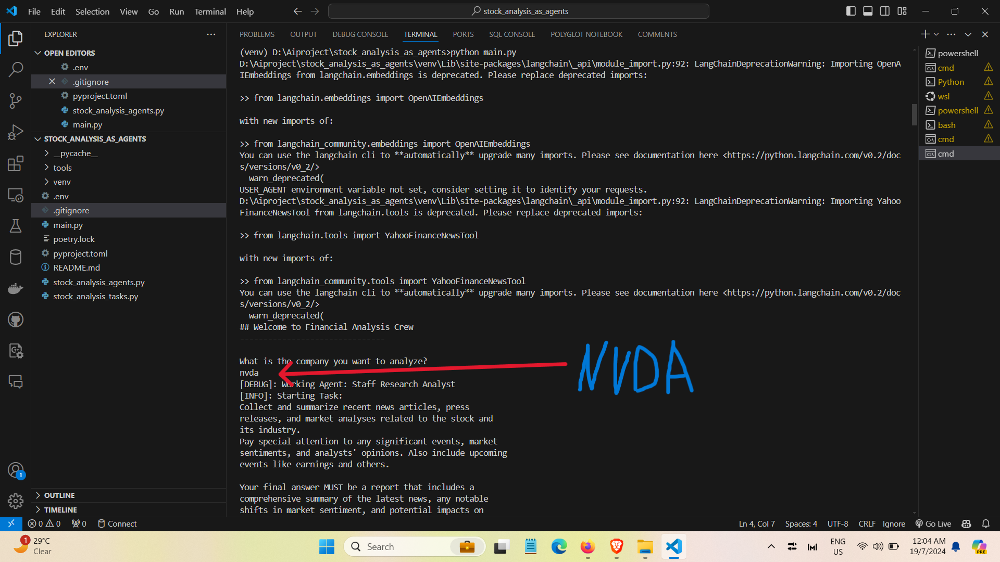
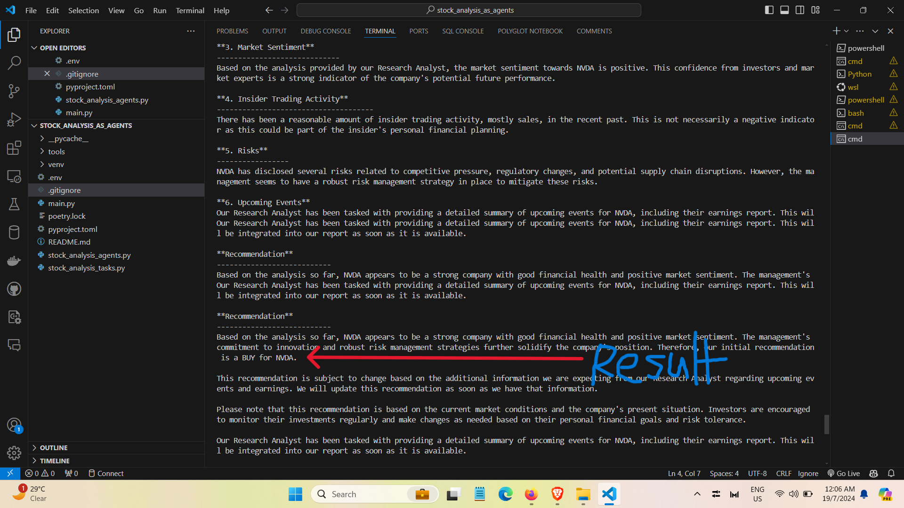

### Screenshots




Original project from here https://github.com/crewAIInc/crewAI-examples/tree/main/stock_analysis

```markdown
# AI-Powered Stock Analysis Tool

This project uses AI agents to perform comprehensive stock analysis, with a special focus on NVIDIA (NVDA). It leverages the CrewAI framework to orchestrate autonomous AI agents for efficient stock analysis.

## Recent Changes and Enhancements

1. **Dependency Updates:**
   I've updated the project dependencies to include specific versions for better compatibility and reproducibility. The key packages installed are:

   ```
   pip install crewai unstructured==0.10.25 pyowm==3.3.0 tools==0.1.9 wikipedia==1.4.0 yfinance==0.2.35 sec-api==1.0.17 tiktoken==0.5.2 python-dotenv==1.0.0 langchain-community==0.0.10 langchain-core==0.1.8 openai==1.7.1
   ```

   Additionally, I've installed `faiss-cpu` without specifying a version for flexibility:
   ```
   pip install faiss-cpu
   ```

2. **NVIDIA-Specific Analysis:**
   I've added a specialized analysis for NVIDIA (NVDA) stock, providing deeper insights into the company's performance in key areas such as AI, Gaming, and Data Centers.

## Installation

To set up this project, follow these steps:

1. Clone the repository:
   ```
   git clone https://github.com/your-username/your-repo-name.git
   cd your-repo-name
   ```

2. Create and activate a virtual environment (optional but recommended):
   ```
   python -m venv venv
   source venv/bin/activate  # On Windows, use `venv\Scripts\activate`
   ```

3. Install the required packages:
   ```
   pip install crewai unstructured==0.10.25 pyowm==3.3.0 tools==0.1.9 wikipedia==1.4.0 yfinance==0.2.35 sec-api==1.0.17 tiktoken==0.5.2 python-dotenv==1.0.0 langchain-community==0.0.10 langchain-core==0.1.8 openai==1.7.1
   pip install faiss-cpu
   ```

   Note: The `faiss-cpu` package is installed without a specific version to ensure compatibility with the latest updates.

## Features

- General stock analysis for any company
- Specialized NVIDIA (NVDA) analysis
- AI-powered insights into stock performance
- Competitive analysis in the tech sector
- Utilizes `faiss-cpu` for efficient similarity search and clustering
- Incorporates `langchain-community` and `langchain-core` for enhanced language model interactions
- Leverages `crewai` for orchestrating AI agents
- Uses `yfinance` for fetching stock data
- Employs `sec-api` for accessing SEC filings

## How to Use

1. Ensure all dependencies are installed and your virtual environment is activated (if using one).

2. Set up your environment variables:
   Create a `.env` file in the project root and add your API keys:
   ```
   OPENAI_API_KEY=your_openai_api_key
   SEC_API_KEY=your_sec_api_key
   # Add any other required API keys
   ```

3. Run the script:
   ```
   python main.py
   ```

4. When prompted, enter the ticker symbol or name of the company you want to analyze (e.g., "NVDA" for NVIDIA).

5. For NVIDIA, the tool will perform both a general analysis and a specialized NVIDIA analysis.

## Sample Output

[Include a brief sample of the output here, especially for the NVIDIA-specific analysis]

## Troubleshooting

If you encounter any issues with `faiss-cpu`, try specifying a version that is compatible with your system:
```
pip install faiss-cpu==<compatible_version>
```

Replace `<compatible_version>` with the appropriate version number.

## Contributing

While this project is primarily for my personal portfolio, suggestions for improvements are welcome. Feel free to open an issue if you have ideas for enhancing the stock analysis capabilities.

## License

This project is released under the MIT License.

```

This README now reflects your specific work on the project, including:

1. The exact list of dependencies you installed, with their versions.
2. A more detailed installation process that matches your setup.
3. An expanded features list that highlights the key libraries and tools you're using.
4. A section on setting up environment variables, which is crucial for the project to run correctly.
5. A note about the project being part of your personal portfolio, which is important for potential employers to understand.

Remember to replace "your-username" and "your-repo-name" with your actual GitHub username and repository name. Also, if you have any screenshots of the tool in action, particularly showing the NVIDIA-specific analysis, you might want to add those to make the README more visually appealing.